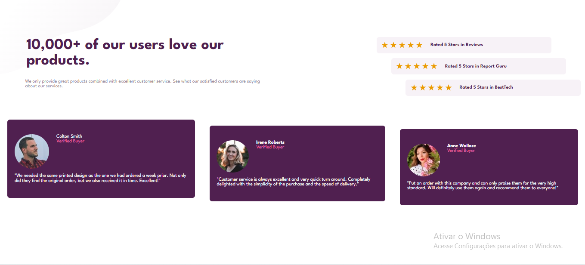
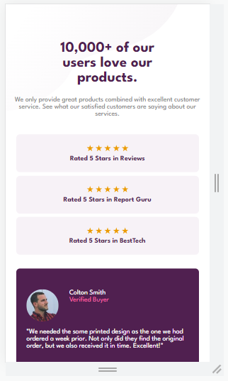
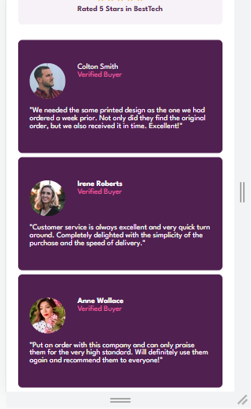

# Frontend Mentor - Social proof section solution

This is a solution to the [Social proof section challenge on Frontend Mentor](https://www.frontendmentor.io/challenges/social-proof-section-6e0qTv_bA). Frontend Mentor challenges help you improve your coding skills by building realistic projects. 

## Table of contents

- [Telas](#Telas)
- [Links](#Links)
- [Ferramentas](#Ferramentas)
- [Aprendizado](#Aprendizado)
- [Contato](#Contato)

### Telas

### Links

[Solution URL](https://kaiojesus.github.io/SocialProof/index.html)

### Ferramentas

- HTML 5
- CSS
- Git e GitHub

### 📝 Aprendizado

Neste projeto decidi construir no método mobile-first aprendido nos cursos da Alura. Foi bem tranquilo de construir o visual mobile e consegui construir pensando no design desktop, separando os em melhores maneiras. 

Em comparação com o último projeto, esse começou a fluir de maneira mais natural, utilizando recursos aprendidos, sempre desenvolvendo e não "aprendendo passivamente".

### Contato ✉

- [LinkedIn](https://www.linkedin.com/in/kaio-jesus/) 
- [kaiojesus41@gmail.com](kaiojesus41@gmail.com)

